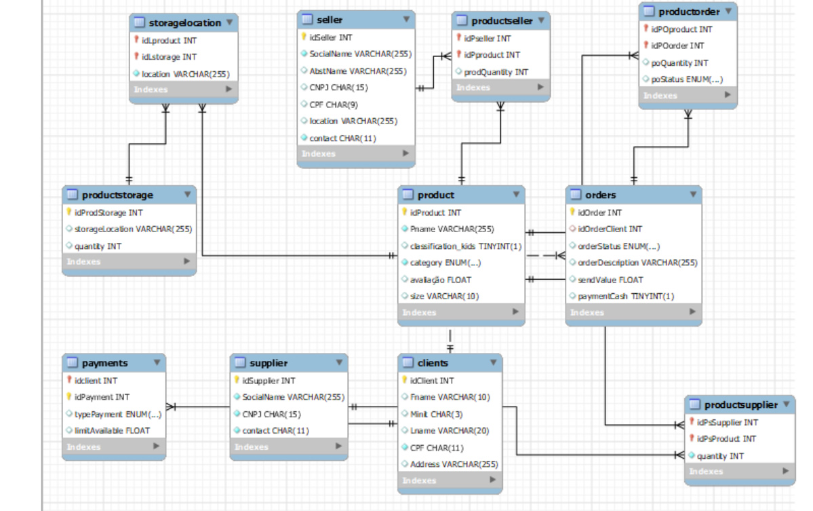

# Desafio DIO - Curso SQL - Modelagem de Dados

Neste desafio foi criado um banco de dados relacional com base no modelo de dados feito num desafio anterior. O banco de dados se refere a um e-commerce.

O repositório tem o modelo relacional, o banco de dados e consultas executadas sobre esta base.

